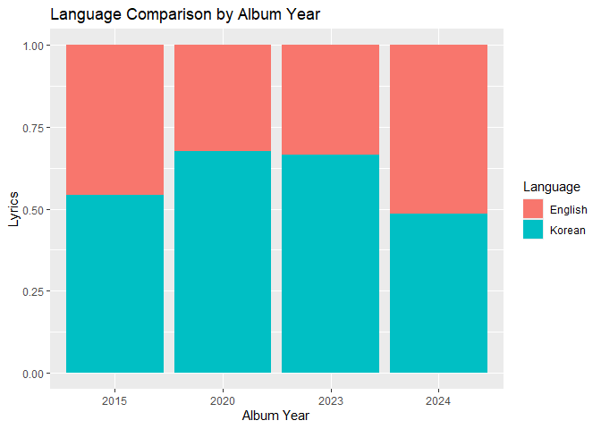
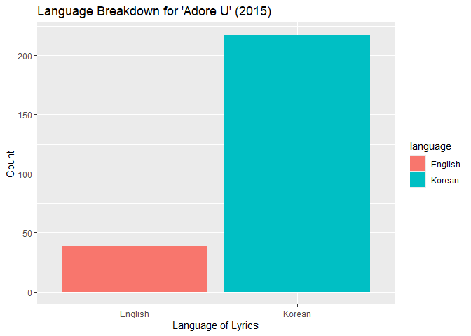
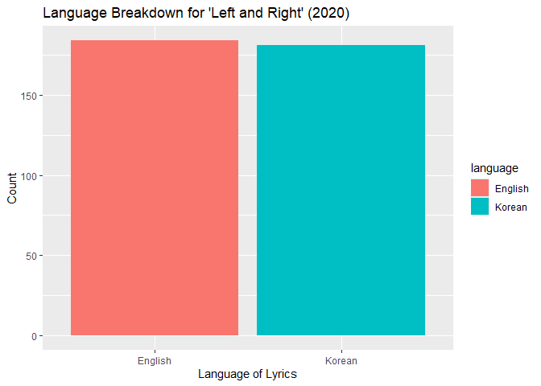
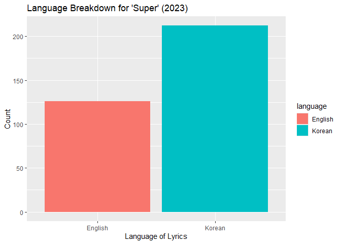
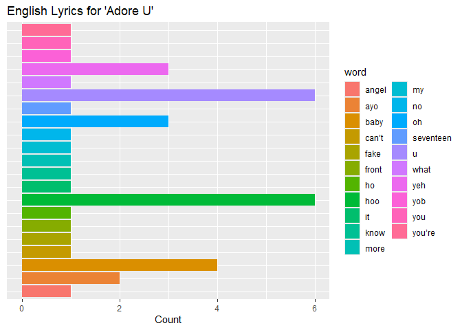

## Reading in the Data

The code below shows the code I used to read in the data, where each
song is its own csv file. I then created columns for the metadata
associated with each song.

``` r
#reading in packages I will need
library(tidyverse)
```

    ── Attaching core tidyverse packages ──────────────────────── tidyverse 2.0.0 ──
    ✔ dplyr     1.1.4     ✔ readr     2.1.5
    ✔ forcats   1.0.0     ✔ stringr   1.5.1
    ✔ ggplot2   3.5.2     ✔ tibble    3.3.0
    ✔ lubridate 1.9.4     ✔ tidyr     1.3.1
    ✔ purrr     1.1.0     
    ── Conflicts ────────────────────────────────────────── tidyverse_conflicts() ──
    ✖ dplyr::filter() masks stats::filter()
    ✖ dplyr::lag()    masks stats::lag()
    ℹ Use the conflicted package (<http://conflicted.r-lib.org/>) to force all conflicts to become errors

``` r
library(dplyr)
library(stringr)
library(tidytext)

#reading multiple files of data into R and replacing NA's in file to present as true NA's
firstfiles <- list.files(pattern=".csv") |>
  read_csv(id = "file", na = c("", "na", "n/a", "N/A", "NA", "Na"))
```

    Rows: 1582 Columns: 2
    ── Column specification ────────────────────────────────────────────────────────
    Delimiter: ","
    chr (1): Lyrics

    ℹ Use `spec()` to retrieve the full column specification for this data.
    ℹ Specify the column types or set `show_col_types = FALSE` to quiet this message.

``` r
#putting each song's metadata in separate columns from file names
firstfiles$track_type = str_extract(firstfiles$file, "Title|Nontitle")
firstfiles$album_year = str_extract(firstfiles$file, "15|20|23|24")

#making the column names uniformly lowercase
 colnames(firstfiles) <- tolower(colnames(firstfiles))
 
#separating out the song names using str_detect and mutate functions
lyrics = firstfiles |>
  mutate(
    file = as.character(file),
  song_title = case_when(
    str_detect(file, "Nontitle_Ah_Yeah_15.csv") ~ "Ah Yeah",
    str_detect(file, "Nontitle_April_shower_23.csv") ~ "April Shower",
    str_detect(file, "Nontitle_Candy_24.csv") ~ "Candy",
    str_detect(file, "Nontitle_Dust_23.csv") ~ "Dust",
    str_detect(file, "Nontitle_Eyes_On_You_24.csv") ~ "Eyes On You",
    str_detect(file, "Nontitle_F_ck_My_Life_23.csv") ~ "F_ck My Life",
    str_detect(file, "Nontitle_Fearless_20.csv") ~ "Fearless",
    str_detect(file, "Nontitle_Fire_23.csv") ~ "Fire",
    str_detect(file, "Nontitle_I_Dont_Understand_But_I_Luv_U_23.csv") ~ "I Don't Understand But I Luv U",
    str_detect(file, "Nontitle_I_Wish_20.csv") ~ "I Wish",
    str_detect(file, "Nontitle_Jam_Jam_15.csv") ~ "Jam Jam",
    str_detect(file, "Nontitle_Kidult_20.csv") ~ "Kidult",
    str_detect(file, "Nontitle_My_My_20.csv") ~ "My My",
    str_detect(file, "Nontitle_Rain_24.csv") ~ "Rain",
    str_detect(file, "Nontitle_Shining_Diamond_15.csv") ~ "Shining Diamond",
    str_detect(file, "Nontitle_Together_20.csv") ~ "Together",
    str_detect(file, "Nontitle_Twenty_15.csv") ~ "Twenty",
    str_detect(file, "Nontitle_Water_24.csv") ~ "Water",
    str_detect(file, "Title_Adore_U_15.csv") ~ "Adore U",
    str_detect(file, "Title_Left_and_Right_20.csv") ~ "Left and Right",
    str_detect(file, "Title_Love_Money_Fame_24.csv") ~ "Love Money Fame",
    str_detect(file, "Title_One_to_Thirteen_24.csv") ~ "One to Thirteen",
    str_detect(file, "Title_Super_23.csv") ~ "Super"),
  #reformatting the year of each album to be written out fully
  album_year = case_when(
    str_detect(album_year, "24") ~ "2024",
    str_detect(album_year, "23") ~ "2023",
    str_detect(album_year, "20") ~ "2020",
    str_detect(album_year, "15") ~ "2015")
  ) ->> lyrics
```

## Tidying the Data

After reading in the individual files of each song and creating neat
columns for the metadata related to each song, I end up with a tidy
dataframe called “lyrics”:

``` r
lyrics 
```

    # A tibble: 1,582 × 5
       file                    lyrics               track_type album_year song_title
       <chr>                   <chr>                <chr>      <chr>      <chr>     
     1 Nontitle_Ah_Yeah_15.csv 아 예 아 예 근데 뭐라구요?…… Nontitle   2015       Ah Yeah   
     2 Nontitle_Ah_Yeah_15.csv Yo $. Coup$, Here’s… Nontitle   2015       Ah Yeah   
     3 Nontitle_Ah_Yeah_15.csv 등장과 동시에 들러리들 바닥에서…… Nontitle   2015       Ah Yeah   
     4 Nontitle_Ah_Yeah_15.csv 침 흘리며 기절 그 위에서 수영해요… Nontitle   2015       Ah Yeah   
     5 Nontitle_Ah_Yeah_15.csv WOAH 옆구리 지방튜브 끼고 못 … Nontitle   2015       Ah Yeah   
     6 Nontitle_Ah_Yeah_15.csv 애들이 알리 있나     Nontitle   2015       Ah Yeah   
     7 Nontitle_Ah_Yeah_15.csv 못 뜬 이유 절대 모름 (Don’t… Nontitle   2015       Ah Yeah   
     8 Nontitle_Ah_Yeah_15.csv 맞출 생각 없어       Nontitle   2015       Ah Yeah   
     9 Nontitle_Ah_Yeah_15.csv 니 식견에 날 맞추지 말길…… Nontitle   2015       Ah Yeah   
    10 Nontitle_Ah_Yeah_15.csv 막 귀들 방구석 박혀 밖에 나오질 … Nontitle   2015       Ah Yeah   
    # ℹ 1,572 more rows

With this “lyrics” dataframe, I can then pivot the data to be longer,
making each word of the song lyrics its own row:

``` r
#putting each word of the lyrics as its own row and feeding it back into the dataframe
lyrics |> 
  unnest_tokens(word, "lyrics") |> arrange(desc(album_year)) -> lyrics
lyrics
```

    # A tibble: 6,418 × 5
       file                  track_type album_year song_title word    
       <chr>                 <chr>      <chr>      <chr>      <chr>   
     1 Nontitle_Candy_24.csv Nontitle   2024       Candy      우리    
     2 Nontitle_Candy_24.csv Nontitle   2024       Candy      사탕    
     3 Nontitle_Candy_24.csv Nontitle   2024       Candy      같은    
     4 Nontitle_Candy_24.csv Nontitle   2024       Candy      사랑해요
     5 Nontitle_Candy_24.csv Nontitle   2024       Candy      자그만  
     6 Nontitle_Candy_24.csv Nontitle   2024       Candy      말      
     7 Nontitle_Candy_24.csv Nontitle   2024       Candy      하나에도
     8 Nontitle_Candy_24.csv Nontitle   2024       Candy      기분이  
     9 Nontitle_Candy_24.csv Nontitle   2024       Candy      좋아질  
    10 Nontitle_Candy_24.csv Nontitle   2024       Candy      수      
    # ℹ 6,408 more rows

### Language Detection

Now that each word can be evaluated separately, I can to detect the
language of the word. Because Korean and English use separate alphabets,
I could simply use stringr functions to detect Hangul versus Latin
alphabet use in each word. A new column was created to hold this
information on the language of the words. The mutated “lyrics” dataframe
that holds this new column was renamed to “lyricsdf”.

``` r
#mutating the dataframe to detect language of rows of lyrics and create language column
lyricdf <- lyrics |>
  mutate(
    word   = as.character(word),
  language = case_when(
  str_detect(word, "[가-힣]") ~ "Korean",
  str_detect(word, "[a-zA-z 12345]") ~ "English"
)) ->> lyricsdf
  
lyricsdf
```

    # A tibble: 6,418 × 6
       file                  track_type album_year song_title word     language
       <chr>                 <chr>      <chr>      <chr>      <chr>    <chr>   
     1 Nontitle_Candy_24.csv Nontitle   2024       Candy      우리     Korean  
     2 Nontitle_Candy_24.csv Nontitle   2024       Candy      사탕     Korean  
     3 Nontitle_Candy_24.csv Nontitle   2024       Candy      같은     Korean  
     4 Nontitle_Candy_24.csv Nontitle   2024       Candy      사랑해요 Korean  
     5 Nontitle_Candy_24.csv Nontitle   2024       Candy      자그만   Korean  
     6 Nontitle_Candy_24.csv Nontitle   2024       Candy      말       Korean  
     7 Nontitle_Candy_24.csv Nontitle   2024       Candy      하나에도 Korean  
     8 Nontitle_Candy_24.csv Nontitle   2024       Candy      기분이   Korean  
     9 Nontitle_Candy_24.csv Nontitle   2024       Candy      좋아질   Korean  
    10 Nontitle_Candy_24.csv Nontitle   2024       Candy      수       Korean  
    # ℹ 6,408 more rows

## Visualizing and Analyzing the Data

### Language Use Overview

With the lyrics parsed and the language use detected, I could move on to
considering the data as a whole.

The language breakdown of the lyrics altogether lean majority Korean,
which is to be expected for music made by Koreans in Korea:

``` r
#to count the language breakdown of the lyrics overall
lyricsdf |> count(language, sort=TRUE)
```

    # A tibble: 3 × 2
      language     n
      <chr>    <int>
    1 Korean    3621
    2 English   2508
    3 <NA>       289

``` r
#...and visualize it:
ggplot(data=subset(lyricsdf, !is.na(language)), aes(x = language)) +
  geom_bar(fill = "salmon")+ theme_light() + xlab("Language") + ylab("Count") + labs(title = "Overall Language Use")
```


``` r
ggsave("Overall Language Use.png")
```

    Saving 7 x 5 in image

### Language Use by Album

However, it is more important to view the lyrics based off of **when**
they were released. One of the goals of this research was to investigate
whether language use changes over time and/or as their popularity rises.
Both a total count view and a percentage view is provided so that the
language comparison within each album is clear as well as across the
language comparison across albums.

``` r
#code meant to count the language breakdown of lyrics by album
table(lyricsdf$album_year, lyricsdf$language)
```

          
           English Korean
      2015     828    980
      2020     494   1031
      2023     476    944
      2024     710    666

``` r
#...and visualize it:
ggplot(data=subset(lyricsdf, !is.na(language)), aes(x = language, fill = album_year, na.rm = FALSE)) +
  geom_bar(position = "dodge") + xlab("Language") + ylab("Lyrics") + labs(fill = "Album Year")  + labs(title = "Language Use for Each Album Year")
```


``` r
ggsave("Language Use for Each Album Year.png")
```

    Saving 7 x 5 in image

``` r
ggplot(data=subset(lyricsdf, !is.na(language)), aes(x = album_year, fill = language)) +
  geom_bar(position = "fill") + xlab("Album Year") + ylab("Lyrics") + labs(fill = "Language") + labs(title = "Language Comparison by Album Year")
```



``` r
ggsave("Language Comparison by Album Year.png")
```

    Saving 7 x 5 in image

### Zooming in on Track Type

Some nuance is lost in this zoomed out view, so I also sorted viewed the
language use by song within each album. Then, I viewed the language use
particularly of the “title” tracks of each album. A title track refers
to the song that is mainly promoted from an album. This title track
would have a music video, advertisements leading up to the album’s
release focusing on the track, and would be the song that is performed
on weekly or year-end music shows. Functionally, a title track is
treated differently by fans and artists alike, acting as the centerpiece
to that album’s concept, message, and (in most cases) the public,
‘non-fan’ image.

``` r
#sorting songs into albums:
filter(lyricsdf, album_year == "2024") ->> byalbum24
filter(lyricsdf, album_year == "2023") ->> byalbum23
filter(lyricsdf, album_year == "2020") ->> byalbum20
filter(lyricsdf, album_year == "2015") ->> byalbum15

#visualizing language use by album and song using objects from above ^: 
ggplot(data=subset(byalbum15, !is.na(language)), aes(y = song_title, fill = language)) +
  geom_bar(position = "fill") + xlab("Lyrics") + ylab("Songs") + labs(title= "Language Use for Debut (2015) Album")
```


``` r
ggsave("Language Use for Debut.png")
```

    Saving 7 x 5 in image

``` r
ggplot(data=subset(byalbum20, !is.na(language)), aes(y = song_title, fill = language)) +
  geom_bar(position = "fill") + xlab("Lyrics") + ylab("Songs") + labs(title= "Language Use for Mid-Career (2020) Album")
```


``` r
ggsave("Language Use for Mid-Career.png")
```

    Saving 7 x 5 in image

``` r
ggplot(data=subset(byalbum23, !is.na(language)), aes(y = song_title, fill = language)) +
  geom_bar(position = "fill") + xlab("Lyrics") + ylab("Songs") + labs(title= "Language Use for Best-selling (2023) Album")
```


``` r
ggsave("Language Use for Best-selling.png")
```

    Saving 7 x 5 in image

``` r
ggplot(data=subset(byalbum24, !is.na(language)), aes(y = song_title, fill = language)) +
  geom_bar(position = "fill") + xlab("Lyrics") + ylab("Songs") + labs(title= "Language Use for Latest (2024) Album")
```


``` r
ggsave("Language Use for Latest.png")
```

    Saving 7 x 5 in image

``` r
#filtering so that only the title tracks are included:
filter(lyricsdf, song_title == "Adore U") ->> debuttitle
filter(lyricsdf, song_title == "Left and Right") ->> midtitle
filter(lyricsdf, song_title == "Super") ->> bestitle
filter(lyricsdf, song_title == "Love Money Fame") ->> latesttitle


#visualizing the language breakdown of each title track:
ggplot(data=subset(debuttitle, !is.na(language)), aes(x = language, fill = language)) +
  geom_bar(position = "dodge") + xlab("Language of Lyrics") + ylab("Count") + labs(title= "Language Breakdown for 'Adore U' (2015)")
```



``` r
ggplot(data=subset(midtitle, !is.na(language)), aes(x = language, fill = language)) +
  geom_bar(position = "dodge") + xlab("Language of Lyrics") + ylab("Count") + labs(title= "Language Breakdown for 'Left and Right' (2020)")
```



``` r
ggplot(data=subset(bestitle, !is.na(language)), aes(x = language, fill = language)) +
  geom_bar(position = "dodge") + xlab("Language of Lyrics") + ylab("Count") + labs(title= "Language Breakdown for 'Super' (2023)")
```



``` r
ggplot(data=subset(latesttitle, !is.na(language)), aes(x = language, fill = language)) +
  geom_bar(position = "dodge") + xlab("Language of Lyrics") + ylab("Count") + labs(title= "Language Breakdown for 'Love, Money, Fame' (2024)")
```


### English Highlights

``` r
#taking a closer look at the English lyrics in each title track: 
filter(debuttitle, language == "English") ->> adoreu
filter(midtitle, language == "English") ->> leftright
filter(bestitle, language == "English") ->> super
filter(latesttitle, language == "English") ->> lovemoneyfame


#visualization for English lyrics in 2024 title track:
ggplot(data=subset(lovemoneyfame, !is.na(language)), aes(y = word, fill = word)) +
  geom_bar(position = "dodge") + xlab("Count") + ylab("English Words") + labs(title= "English Lyrics for 'Love, Money, Fame'") + theme(axis.title.y=element_blank(),
         axis.text.y=element_blank(),
        axis.ticks.y=element_blank())
```


``` r
#visualization for English lyrics in 2023 title track: 
ggplot(data=subset(super, !is.na(language)), aes(y = word, fill = word)) +
  geom_bar(position = "dodge") + xlab("Count") + ylab("English Words") + labs(title= "English Lyrics for 'Super'") + theme(axis.title.y=element_blank(),
         axis.text.y=element_blank(),
        axis.ticks.y=element_blank())
```


``` r
#visualization for English lyrics in 2020 title track: 
ggplot(data=subset(leftright, !is.na(language)), aes(y = word, fill = word)) +
  geom_bar(position = "dodge") + xlab("Count") + ylab("English Words") + labs(title= "English Lyrics for 'Left and Right'") + theme(axis.title.y=element_blank(),
         axis.text.y=element_blank(),
        axis.ticks.y=element_blank())
```


``` r
#visualization for English lyrics in 2015 title track: 
ggplot(data=subset(adoreu, !is.na(language)), aes(y = word, fill = word)) +
  geom_bar(position = "dodge") + xlab("Count") + ylab("English Words") + labs(title= "English Lyrics for 'Adore U'") + theme(axis.title.y=element_blank(),
         axis.text.y=element_blank(),
        axis.ticks.y=element_blank())
```


